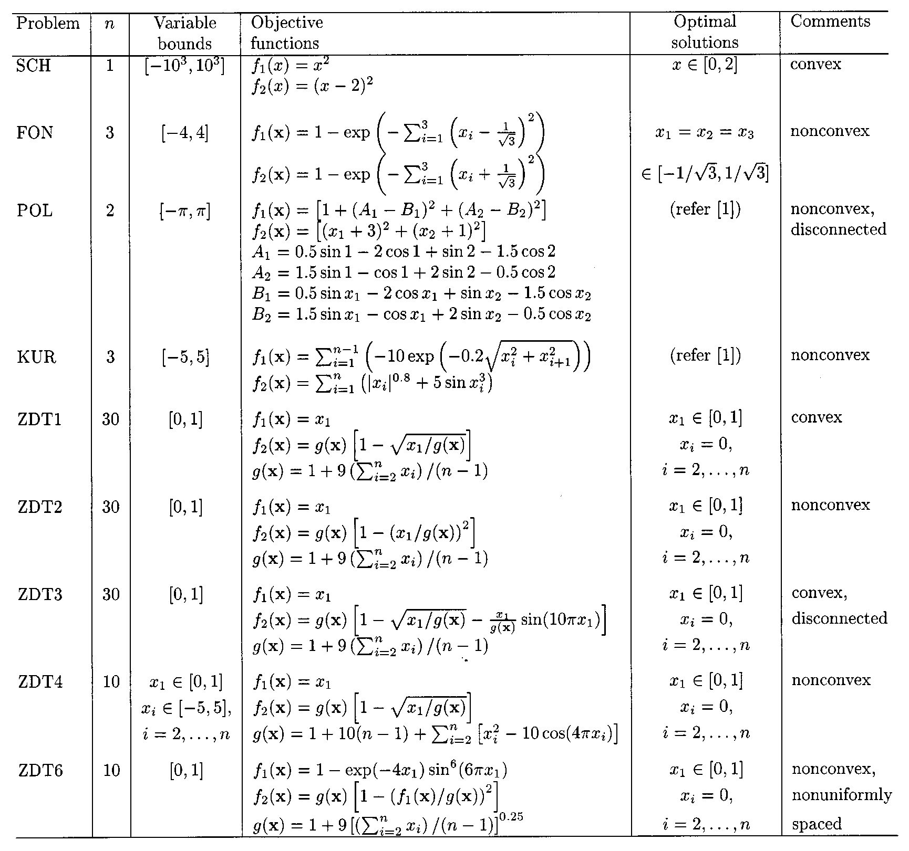
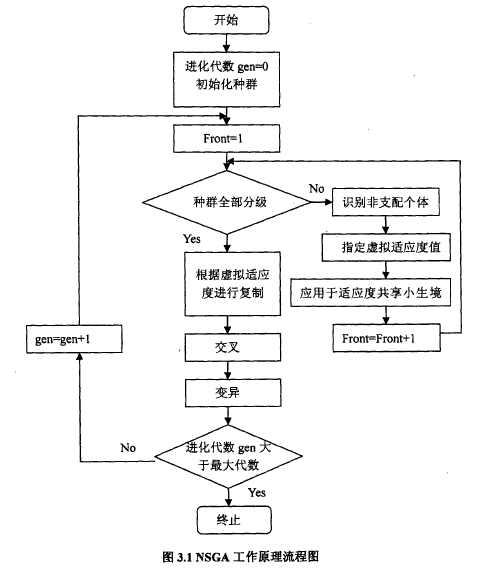
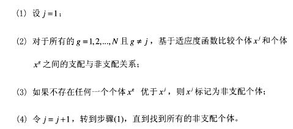
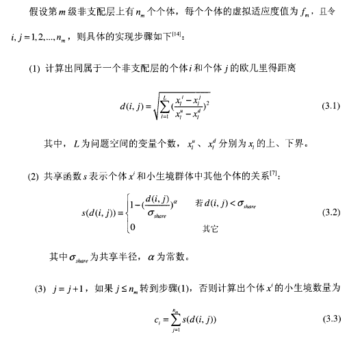
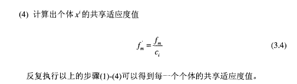
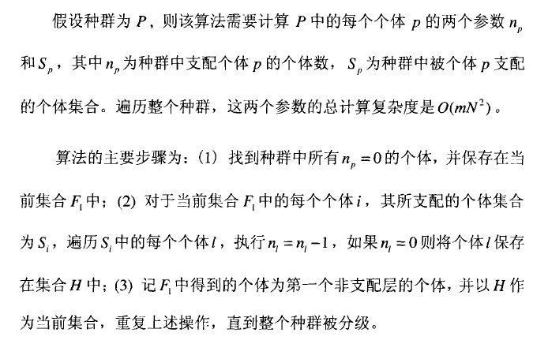
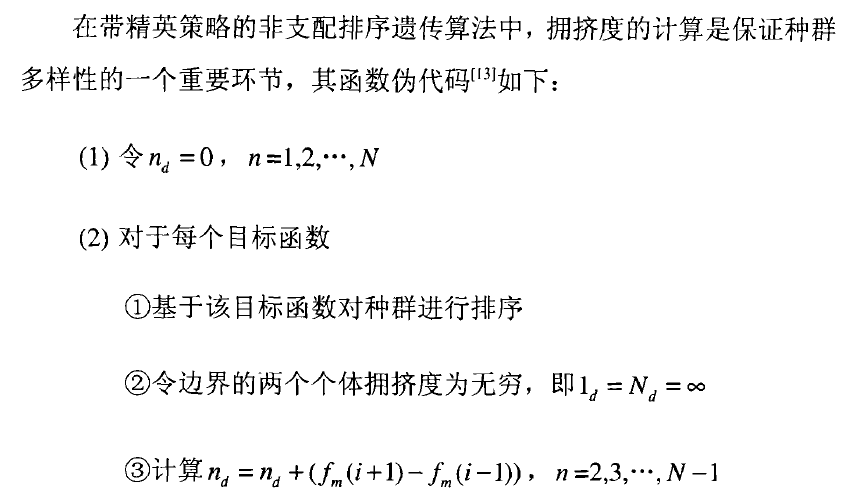
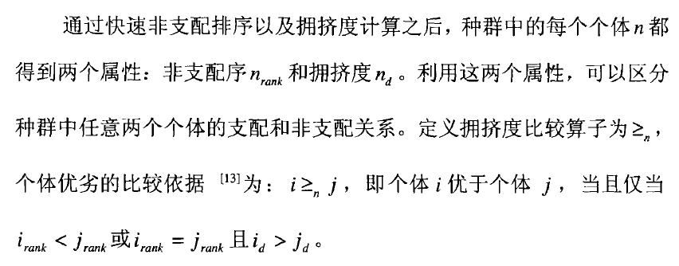

# 名词解释

多目标优化求解

>  对于多目标优化问题，一个解对于某个目标来说可能是较好的，但是对于另一个目标可能较差。因而存在一个折中的解集合—Pareto最优解集（Pareto-Optimal set）或非支配解集(non-dominated set)

Pareto最优解集

> 帕累托最优描述的是一种资源最优化配置的状态。正如上面各位知友所说，在帕累托最优的条件下，是没有办法在不让某一参与资源分配的一方利益受损的情况下，令另一方获得更大利益的。

进化多目标优化（Evolutionary multi-objective optimization, EMO)

> 利用进化计算的方法求解多目标优化问题

# 多目标优化问题数学描述

# 常见的多目标优化问题

# 通过加权将多目标问题转化为单目标问题

- 早期，多目标优化问题往往通过加权的方式转化为单目标优化问题，再通过数学规划的方式求解；
- 这样每次只能得到对应权值下的最优解；
- 多目标优化的目标函数和约束函数可能是非线性的、不可微、不连续的；
- 效率低，且受到对于权值或目标给定的次序敏感；

# 进化算法

通过代与代之间维持由潜在解组成的种群来实现全局搜索；

---

2003年之前：

- 第一代进化多目标优化算法采用**基于 Pareto 等级的个体选择方法和基于适应度共享机制的种群多样性保持策略**；

- 第二代进化多目标优化算法特点是**精英保留**机制—NSGA-2（Non-Dominated Sorting Genetic Algorithm）；

---

# 第一代EMO算法

- MOGA
- NSGA
- NPGA

# 第二代EMO算法

精英保留策略的引入作为标志

- SPEA、SPEA2
- PAES、PESA、PESA2
- NSGA2

# NSGA

- 非支配分层的方法，使得好的个体有更大机会遗传；
- 适应度共享策略则使得准Pareto面上的个体均匀分布,保持了群体多样性；

## 非支配排序

上述操作过后就是一级非直配层；将其忽略就可以得到二级非支配层；以此类推

## 虚拟适应值确定

对种群进行非支配排序的过程中，需要给每一个非支配层指定一个虚拟的适应度值。级数越大，虚拟适应度越小，以保证选择操作中等级低的非支配个体有更多机会被选择进入下一代；

此外引入了基于拥挤策略的小生境技术，通过适应度共享函数的方法对原先指定的虚拟适应度进行重新指定；

# NSGAⅡ

核心思想为从第二代开始将父代与子代种群合并，进行快速非支配排序，个体进行拥挤度计算，选择新的合适的个体组成父代种群；

## 快速非支配排序算法

##  拥挤度

##  拥挤度比较算子

# 实数模拟二进制的交叉变异操作

## 交叉操作（SBX）

模拟二进制交叉
$$
x_{1j}(t) = 0.5\times[(1+\gamma_j)x_{1j}(t) + (1-\gamma_j)x_{2j}(t)] \\
x_{2j}(t) = 0.5\times[(1-\gamma_j)x_{1j}(t) + (1+\gamma_j)x_{2j}(t)]\\

其中，\gamma_j = 
\begin{cases}
(2u_j)^{\frac1{1+\eta}}, & u_j<0.5 \\
\frac1{2(1-u_j)}^{\frac1{1+\eta}}, & else

\end{cases}
,且u_j为[0,1]的随机数；
$$

## 多项式变异

多项式变异
$$
x_{1j}(t) = x_{1j}(t)  +\Delta_j  \\

其中，\Delta_j = 
\begin{cases}
(2u_j)^{\frac1{1+\eta}}-1, & u_j<0.5 \\
(1-{2(1-u_j)})^{\frac1{1+\eta}}, & else

\end{cases}
,且u_j为[0,1]的随机数；
$$

