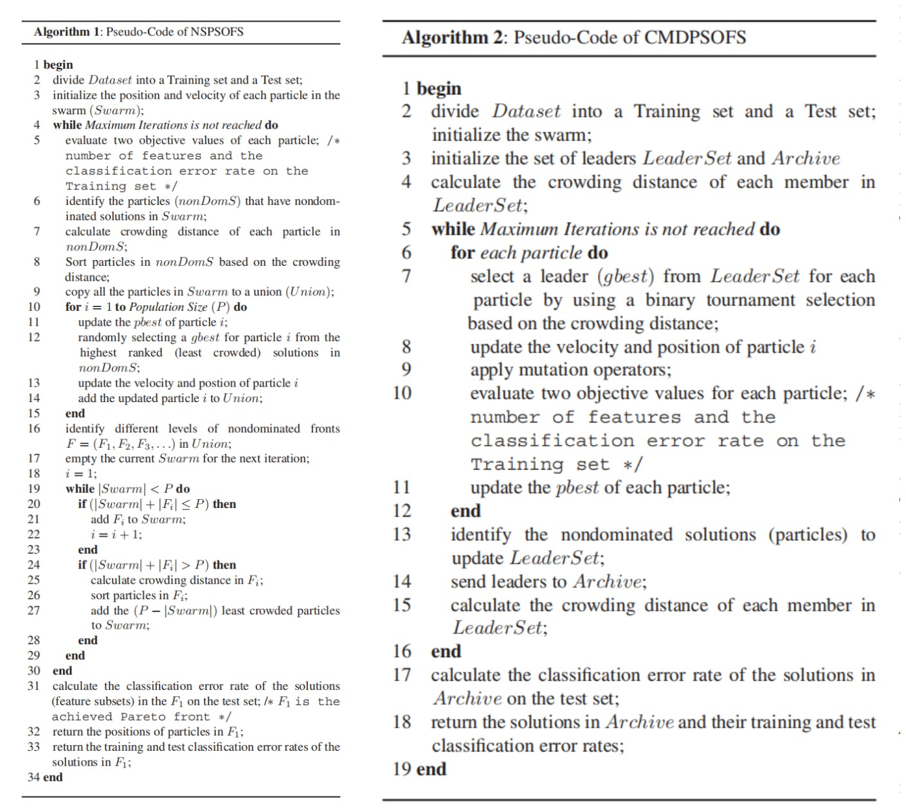

# 进化多目标优化特征选择

> Xue B, Zhang M, Browne W N. Particle swarm optimization for feature selection in classification: A multi-objective approach[J]. IEEE transactions on cybernetics, 2012, 43(6): 1656-1671.

文章使用基于PSO的多目标优化算法进行特征选择，提出了两种方法

- NSPSOFS (nondominated sorting PSO feature selection)
- CMDPSOFS (crowding , mutation ,dominace PSO feature selection)

# 项目结构

由于存在函数命名冲突问题，因此项目入口如下图所示

其他几个算法只需要打开对应的脚本文件直接执行即可，对于NSGA-Ⅱ打开直接运行里面的main.m即可；

对于几个特征选择算法，运行过后的变量

- solution表示最终筛选的最优个体
- solutionFlag表示对应个体是否选择了某个特征，1表示选择，0表示不选择
- solutionNum表示选择特征的数量
- solutionTrainErr表示在训练集上的错误率
- solutionTestErr表示在测试集上的错误率

# 尚存在的问题

1. NSGA-Ⅱ在原文中使用的是二进制编码，该项目中没注意选用了和其他算法相同的编码方式（浮点数编码并用theta = 0.6来决定特征是否选择）

2. CMDPSOFS 中提到的 有关mutation分别使用了

   - NO mutation
   - uniform mutation
   - nonuniform mutation

   给出的连接论文中也没有找到最后一种变异的详细参数，选用了一种网上搜集到的方法；

   

3. 文章使用了40次独立实验取平均值的方式来验证性能，因为每次训练需要一定的时间，因此只是做了几组和论文中现实的平均结果做了对比；
4. 目前只在wine一组数据集上做了相关实验；
5. 论文中使用了T检验去证明和对比各个算法的性能，该项目暂时没有做到；
6. 关于Archive那里还存在一些理解上的问题，出于最优结果考虑做出了处理；
7. 论文中使用了Java machine learning library，本项目由于使用的是matlab，故直接选用了matlab的 Statistics and Machine Learning Toolbox中封装的KNN和交叉验证；

